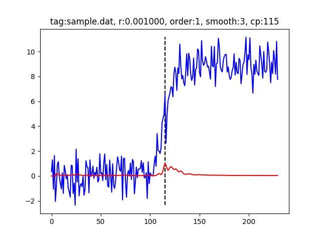

# changefinder_sample

Testing script to check behavior of ChangeFinder algorithm.

## What's this program?

An useful script to run ChangeFinder algorithm with multiple paramters.

### Tested environment and dependencies

- Python 3.6.7
- [changefinder](https://pypi.org/project/changefinder/)
- numpy
- matplotlib

All the libraries can be installed via `pip`.

## How to use

### Data creation

`python data_creator.py sample.dat`

- The last argument should be a file name for output.
- If you want to data shape or characteristics, modify `makeDataCore` function.

### Run ChangeFinder

`python main.py sample.dat`

- The last argument should be a file name of data.
- If you wanto to change parameters, specifically `r`, `order`, `smooth`, modify `r_list`, `order_list`, `smooth_list` variables. All the combination will be tested.

[Author's page of the library](http://argmax.jp/index.php?changefinder) can be helpful about parameters.

### Result sample

If you run this script with the default setting, you'll get these results.

```sh
$ python ./data_creator.py sample.dat
Saved sample.dat

$ python main.py sample.dat
Data sample.dat loaded.
[0/24] r:0.001000, order:1, smooth:3
[1/24] r:0.001000, order:1, smooth:5
[2/24] r:0.001000, order:3, smooth:3
[3/24] r:0.001000, order:3, smooth:5
[4/24] r:0.001000, order:5, smooth:3
[5/24] r:0.001000, order:5, smooth:5
[6/24] r:0.010000, order:1, smooth:3
[7/24] r:0.010000, order:1, smooth:5
[8/24] r:0.010000, order:3, smooth:3
[9/24] r:0.010000, order:3, smooth:5
[10/24] r:0.010000, order:5, smooth:3
[11/24] r:0.010000, order:5, smooth:5
[12/24] r:0.100000, order:1, smooth:3
[13/24] r:0.100000, order:1, smooth:5
[14/24] r:0.100000, order:3, smooth:3
[15/24] r:0.100000, order:3, smooth:5
[16/24] r:0.100000, order:5, smooth:3
[17/24] r:0.100000, order:5, smooth:5
[18/24] r:0.300000, order:1, smooth:3
[19/24] r:0.300000, order:1, smooth:5
[20/24] r:0.300000, order:3, smooth:3
[21/24] r:0.300000, order:3, smooth:5
[22/24] r:0.300000, order:5, smooth:3
[23/24] r:0.300000, order:5, smooth:5
Done

$ ls *.png
out_sample.dat_0.001000_1_3.png  out_sample.dat_0.010000_1_3.png  out_sample.dat_0.100000_1_3.png  out_sample.dat_0.300000_1_3.png
out_sample.dat_0.001000_1_5.png  out_sample.dat_0.010000_1_5.png  out_sample.dat_0.100000_1_5.png  out_sample.dat_0.300000_1_5.png
out_sample.dat_0.001000_3_3.png  out_sample.dat_0.010000_3_3.png  out_sample.dat_0.100000_3_3.png  out_sample.dat_0.300000_3_3.png
out_sample.dat_0.001000_3_5.png  out_sample.dat_0.010000_3_5.png  out_sample.dat_0.100000_3_5.png  out_sample.dat_0.300000_3_5.png
out_sample.dat_0.001000_5_3.png  out_sample.dat_0.010000_5_3.png  out_sample.dat_0.100000_5_3.png  out_sample.dat_0.300000_5_3.png
out_sample.dat_0.001000_5_5.png  out_sample.dat_0.010000_5_5.png  out_sample.dat_0.100000_5_5.png  out_sample.dat_0.300000_5_5.png
```

Output PNG files will be like this.



- ** Anomaly score is normalized into [0.0, 1.0] because its scale drastically changes according to paramters. **
- Vertical dashed line indicates maximum anomaly score.

## License

GPL

